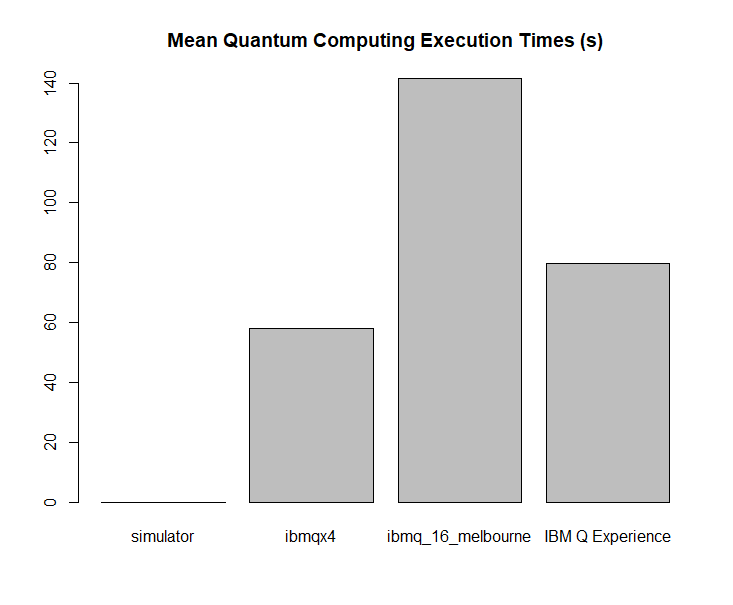

Fly Unicorn
===========

Fly your magical unicorn up into the sky and reach the castle gates!

A game developed for a quantum computer, utilizing the properties of superposition and uncertainty.

## Gameplay

```text
===============
  Fly Unicorn
===============

Your majestic unicorn, Twilight Bow, is ready for flight!
After a long night of preparation and celebration, it's time to visit the castle in the clouds.
Use your keyboard to fly up or down on a quantum computer, as you ascend your way into the castle.


=====================
-[ Altitude 0 feet ]-
Twilight Bow is waiting for you on the ground.
[up,down,quit]: u
You soar into the sky.
Running on the simulator.
Request completed in 0.0m 0.03s
{'0': 949, '1': 51}

=====================
-[ Altitude 51 feet ]-
Twilight Bow is floating gently above the ground.
[up,down,quit]: u
You soar into the sky.
Running on the simulator.
Request completed in 0.0m 0.02s
{'0': 900, '1': 100}

=====================
-[ Altitude 100 feet ]-
Twilight Bow is floating gently above the ground.
[up,down,quit]: u
You soar into the sky.
Running on the simulator.
Request completed in 0.0m 0.02s
{'0': 862, '1': 138}

=====================
-[ Altitude 138 feet ]-
A mischievous quantum cloud blocks your way and challenges you to a game!
He has stolen a magical unicorn jewel from the castle!
If you can guess which jewel is the real one before the cloud, you'll be rewarded.
If you lose, you'll face a penalty.
Do you want to play his game? [yes,no]: y
The mischievous cloud blinks his eyes. You hear a crack of thunder. A unicorn jewel has been chosen.
Psst. The secret is 2
Round 1. Which unicorn jewel is the real one? [amethyst,sapphire,emerald,jade]: emerald
You guessed wrong.
Running on the simulator.
Request completed in 0.0m 0.08s
{'0111': 4, '1100': 2, '0010': 50, '1111': 5, '1011': 7, '0000': 3, '0011': 4, '0001': 4, '0100': 3, '0110': 3, '0101': 4, '1101': 1, '1110': 2, '1000': 3, '1001': 2, '1010': 3}
The mischievous cloud guesses sapphire.
Haha, I win, says the mischievous cloud!
Don't say I didn't warn you! After all, I live in the quantum world! =)
Altitude - 100

=====================
-[ Altitude 38 feet ]-
Twilight Bow is floating gently above the ground.
[up,down,quit]: u
You soar into the sky.
Running on the simulator.
Request completed in 0.0m 0.02s
{'0': 914, '1': 86}

=====================
-[ Altitude 86 feet ]-
A mischievous quantum cloud blocks your way and challenges you to a game!
He has stolen a magical unicorn jewel from the castle!
If you can guess which jewel is the real one before the cloud, you'll be rewarded.
If you lose, you'll face a penalty.
Do you want to play his game? [yes,no]: y
The mischievous cloud blinks his eyes. You hear a crack of thunder. A unicorn jewel has been chosen.
Psst. The secret is 10
Round 1. Which unicorn jewel is the real one? [amethyst,sapphire,emerald,jade]: sapphire
You guessed correct!
Altitude + 100

=====================
-[ Altitude 186 feet ]-
Twilight Bow is hovering just above the evergreen sea of trees.
[up,down,quit]: u
You soar into the sky.
Running on the simulator.
Request completed in 0.0m 0.02s
{'0': 738, '1': 262}

=====================
-[ Altitude 262 feet ]-
Twilight Bow is approaching the first misty cloud layer.
[up,down,quit]: u
You soar into the sky.
Running on the simulator.
Request completed in 0.0m 0.02s
{'0': 625, '1': 375}

=====================
-[ Altitude 375 feet ]-
Twilight Bow has soared through the misty pink clouds.
[up,down,quit]: u
You soar into the sky.
Running on the simulator.
Request completed in 0.0m 0.01s
{'0': 473, '1': 527}

=====================
-[ Altitude 527 feet ]-
Twilight Bow You can barely see the evergreen sea of trees from this high up.
[up,down,quit]: u
You soar into the sky.
Running on the simulator.
Request completed in 0.0m 0.02s
{'0': 236, '1': 764}

=====================
-[ Altitude 764 feet ]-
Twilight Bow You can see the first glimpse of the golden castle gates just above you.
[up,down,quit]: u
You soar into the sky.
Running on the simulator.
Request completed in 0.0m 0.02s
{'0': 14, '1': 986}

=====================
-[ Altitude 986 feet ]-
Twilight Bow swiftly glides through the mystical castle gate. You're almost there.
[up,down,quit]: u
You soar into the sky.
Running on the simulator.
Request completed in 0.0m 0.02s
{'1': 1000}
Congratulations! Twilight Bow soars into the castle gates!
The game ended in 10 rounds. You won, great job! :)
```

## Quantum Computing Metrics

Timing metrics for programs executed on the QisKit simulator versus IBM Q Experience can be found in the [data](data) folder. The directory contains the raw data files of program executions on both platforms and across multiple machines, along with an analytics program used for producing the summary dataset and charts, as shown below.

The metrics include:

```text
machine name
minimum seconds
mean seconds
maximum seconds
```

Machines include ibmqx4, ibmq_16_melbourne, and the QisKit simulator.

## Results

```text
               type runs   min        mean    max
1         simulator  175  0.06   0.1300571   0.25
2            ibmqx4   94 53.81  58.2200000  90.23
3 ibmq_16_melbourne   33 59.87 141.4306061 627.30
4  IBM Q Experience  127 53.81  79.8416535 627.30
```



#### Conclusion

The results record significant wait times for programs executed on IBM Q Experience versus the simulator.

Author
----
Kory Becker
http://www.primaryobjects.com/kory-becker